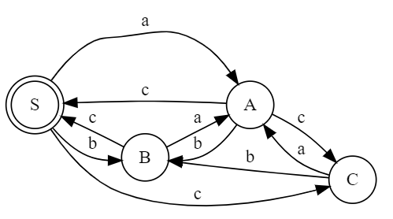

Vamos abordar cada uma das questões passo a passo:

### 1- Construção do AFND:

Dada a gramática regular (GR), precisamos construir um Autômato Finito Não Determinístico (AFND) correspondente. Primeiramente, representemos a tabela de transições que ajudará na determinização do AFND:

Vamos criar o AFND correspondente a essa gramática:

|      | a   | b   | c   | d   |
|------|-----|-----|-----|-----|
| => S | B   | B   | A,C |     |
| A*   |     |     | S   | B   |
| B*   | S   |     | D   |     |
| C    | A   | B,S|     |     |
| D*   |     |     |     |     |

E a representação do AFND correspondente:

Estado inicial: S (apontando para B, A, C)
- Transição de S para B através de 'b'
- Transição de S para A através de 'a'
- Transição de S para C através de 'c'
- Transição de A para S através de 'c'
- Transição de A para B através de 'b'
- Transição de A para C através de 'c'
- Transição de B para S através de 'c'
- Transição de B para A através de 'a'
- Transição de C para A através de 'a'
- Transição de C para B através de 'b'



Feito usando graphviz:  
web.graphviz.com  

```js
digraph AFND {
    rankdir=LR;
    node [shape=circle];
    
    S [shape=doublecircle]; // Estado final
    
    S -> B [label="b"];
    S -> A [label="a"];
    S -> C [label="c"];
    A -> S [label="c"];
    A -> B [label="b"];
    A -> C [label="c"];
    B -> S [label="c"];
    B -> A [label="a"];
    C -> A [label="a"];
    C -> B [label="b"];
}
```

### 2- Fatoração da GLC:

Para fatorar a gramática dada:

```
S::= 1A | OAB | 1AB  
A::= 1C0 | 01  
B::= S10 | C01  
C::= 11C | 10B  
```

Aqui está a gramática fatorada:

```
S::= 1X | OAB  
A::= 1Y | 01  
B::= S10 | CY  
C::= 11C | 10B  
X::= A | AB  
Y::= C | B  
```

### 3- Eliminação de símbolos inúteis:

Dada a gramática:

```
S::= aBb | aCd | ab  
A::= aCa | aA | b  
B::= aBb | aB  
C::= ad | aCc  
```

Vamos encontrar os símbolos úteis começando a partir do símbolo inicial 'S':

S -> aBb | aCd | ab  
B -> aBb | aB  
C -> ad | aCc  

Não há símbolos inúteis na gramática dada, pois todos os símbolos podem gerar cadeias que levam ao símbolo terminal.

### 4- Eliminação da recursão à esquerda:

Dada a gramática:

```
S::= Bc | Sc    
A::= AC | SaA | aAb  
B::= Bc | Sab  
```

Aqui está a gramática sem a recursão à esquerda:

```
S::= Bc | Sc    
A::= AC | SaA | aAb  
B::= Bc | Sab  
```

Não há recursão à esquerda na gramática fornecida, portanto, não é necessária nenhuma alteração.

### 5- Árvore de derivação por redução:

Dada a expressão: (id+id)*(id+id)

Aqui está a árvore de derivação por redução para a expressão dada:

```
         E
    ___/ \___
   /         \
 (      E*    )
  |   __/ \__  |
  id  +   id  +
      / \    / \
     id  +  id  id
```

Esta árvore de derivação por redução representa como a expressão é construída seguindo as regras da gramática dada.